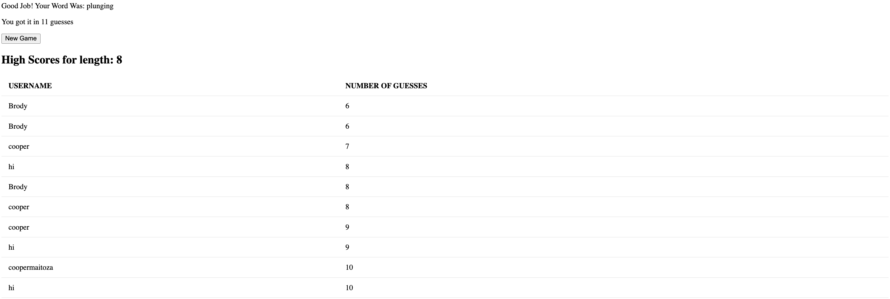

# Hangman_Game_Group

- Teammates: Cooper, Brody, Coleton
- Team Name: TBD
- Team Color: Orange
- [Repo Link](https://github.com/Weber-Cooper-Maitoza/Hangman_Game_Group)
  
## Description

A full functional hangman game featuring a frontend react page, a backend express request, and a mongodb database. This project was built by Cooper Maitoza, Brody Gardner, and Coleton Watt for an assignment in Software Engineering 2. Includes a collection of **10000+** letters

### People

#### Brody Gardner

- Worked on making a fully backend
- Including routes to allow the user to get a new word, guess a letter, and leaderboard
- Managed how the database worked and what was stored
  
### Cooper Maitoza

- Manged the repository
- Created the starter frontend and backend
- Assisted in implementing the frontend and backend
- Implemented the ability to lose and give up (while playing the game)

#### Coleton Watt

- Built a frontend to allow the user to play
- Interfaced with the backend routes used react-dom
- Implemented a high scores page to interact with other players

### Technologies

- MongoDB - Used to store the users data featuring JSON data
- React + Bootstraps - Used to build a functional website that is fully responsive web page based on the screen size
- Express + Cors - Used to make a great backend including routes for all the user interactions

## Screenshots

